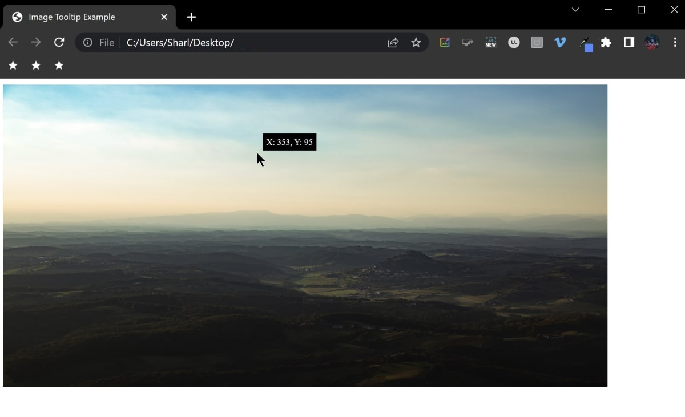

# x-y-coordinates-tooltip
This is a simple example of how to overlay a tooltip over an image, and display the current X and Y coordinates of the cursor

## To Run

* Click on the index.html file to open it in a web browser, and hover over the image.

## Example

